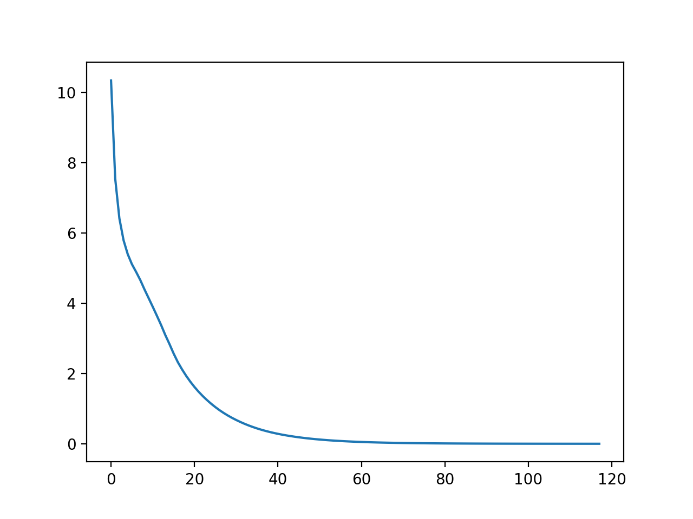

We observe that as the step cost is neither too high nor too low, he plays a balanced game, where he plays neither a risky nor a defensive game, but plays defensively in some situations and plays aggressively in other situations. That is, say the monster is active, in some cases it is favourable for the player to stay at West, South or North, wherever in certain cases the player's best move is to risk getting hit in the hopes of getting a few blows in. 


We observe that if he has any materials but no arrows, then he mostly tries to go to the north square to craft arrows, unless he's already in the east square. Sometimes when the monster is active, IJ will prefer a defensive strategy over going to the north square, if there is a chance of him getting hit. We see that IJ will often move towards East, as it is the prime location for hitting the monster. 

From the center square if IJ has no materials but has arrows, he will move depending on the state and health of the monster. If the monster's health is low enough, then regardless of the state of the monster IJ will try to hit him. Else, if the monster has higher health, and if the monster's state is active, then IJ will try to dodge the attack by going to south or north, and if the monster is in dormant state, then IJ will move to the east square. 

## Convergence Rate


Here we plot average difference between utilities of states in consecutive iterations. We observe that the slope of this graph is of the form `-1/n^2` and conclude that the rate of convergence decreases with every iteration and the differences themselves converge to 0 after infinite iterations.


## Simulation

**Simulation 1**
```
Start state = (W, 0, 0, D, 100)
(W,0,0,D,100):RIGHT=[-221.23]
Next state = (C,0,0,D,100)
(C,0,0,D,100):RIGHT=[-202.633]
Next state = (E,0,0,D,100)
(E,0,0,D,100):HIT_SWORD=[-183.245]
Next state = (E,0,0,D,100)
(E,0,0,D,100):HIT_SWORD=[-183.245]
Next state = (E,0,0,D,100)
(E,0,0,D,100):HIT_SWORD=[-183.245]
Next state = (E,0,0,R,50)
(E,0,0,R,50):HIT_SWORD=[-172.725]
Next state = (E,0,0,R,50)
(E,0,0,R,50):HIT_SWORD=[-172.725]
Next state = (E,0,0,D,75)
(E,0,0,D,75):HIT_SWORD=[-157.567]
Next state = (E,0,0,R,75)
(E,0,0,R,75):HIT_SWORD=[-219.94]
Next state = (E,0,0,D,100)
(E,0,0,D,100):HIT_SWORD=[-183.245]
Next state = (E,0,0,D,100)
(E,0,0,D,100):HIT_SWORD=[-183.245]
Next state = (E,0,0,R,50)
(E,0,0,R,50):HIT_SWORD=[-172.725]
Next state = (E,0,0,D,75)
(E,0,0,D,75):HIT_SWORD=[-157.567]
Next state = (E,0,0,D,25)
(E,0,0,D,25):HIT_SWORD=[-46.681]
Next state = (E,0,0,D,25)
(E,0,0,D,25):HIT_SWORD=[-46.681]
Next state = (E,0,0,R,25)
(E,0,0,R,25):HIT_SWORD=[-105.326]
Next state = (E,0,0,R,0)
(E,0,0,R,0):NONE=[0]
```

When he starts off with no arrows or materials, he will try to go to the east square and hit the monster with his sword. He does not try to gather materials and then craft arrows.

**Simulation 2**
```
Start state = (C,2,0,R,100)
(C,2,0,R,100):UP=[-237.628]
Start state = (N,2,0,R,100)
(N,2,0,R,100):CRAFT_ARROWS=[-209.844]
Start state = (N,1,3,D,100)
(N,1,3,D,100):DOWN=[-185.666]
Start state = (N,1,3,D,100)
(N,1,3,D,100):DOWN=[-185.666]
Start state = (N,1,3,D,100)
(N,1,3,D,100):DOWN=[-185.666]
Start state = (C,1,3,D,100)
(C,1,3,D,100):RIGHT=[-165.761]
Start state = (E,1,3,R,100)
(E,1,3,R,100):HIT_SWORD=[-225.277]
Start state = (E,1,0,D,100)
(E,1,0,D,100):HIT_SWORD=[-183.245]
Start state = (E,1,0,D,100)
(E,1,0,D,100):HIT_SWORD=[-183.245]
Start state = (E,1,0,R,100)
(E,1,0,R,100):HIT_SWORD=[-231.155]
Start state = (E,1,0,R,100)
(E,1,0,R,100):HIT_SWORD=[-231.155]
Start state = (E,1,0,R,100)
(E,1,0,R,100):HIT_SWORD=[-231.155]
Start state = (E,1,0,D,100)
(E,1,0,D,100):HIT_SWORD=[-183.245]
Start state = (E,1,0,D,100)
(E,1,0,D,100):HIT_SWORD=[-183.245]
Start state = (E,1,0,R,50)
(E,1,0,R,50):HIT_SWORD=[-172.725]
Start state = (E,1,0,D,75)
(E,1,0,D,75):HIT_SWORD=[-157.567]
Start state = (E,1,0,R,75)
(E,1,0,R,75):HIT_SWORD=[-219.94]
Start state = (E,1,0,D,100)
(E,1,0,D,100):HIT_SWORD=[-183.245]
Start state = (E,1,0,R,50)
(E,1,0,R,50):HIT_SWORD=[-172.725]
Start state = (E,1,0,R,0)
(E,1,0,R,0):NONE=[0]
```
When he has materials and no arrows then he tries to go to the North square, from the center square. This has a twofold benefit. This dodges the monsters attacks if any, and it allows him to craft arrows. Now that we have arrows, as long as the monster is in active state we try to go to south state to collect more materials and dodge any attacks. Had the monster been in dormant state, we would have gone to the East square where we have a better chance of hitting him with our arrows. In this example, as we got hit in the center square, and lost our arrows since the monster was in dormant state, we decided to go to east and hit him with our sword.

## Task 2 
**Case 1 Analysis**
In this case, we can now go to west directly from east. The policy change that occurs due to this change is that when the player is on East, and the monster has a health of over 75 and is active, the player will now choose to go left instead of attacking the monster, because now he can definitely avoid the monsters hit. The reason he did not do this in the original case was because moving left from east would take him to the center. He still however tries to hit the monster when the monster's health is low or when it is dormant. 

**Case 2 analysis**
In this case, as staying is free, when the player is on west, north or south while the dragon is active, the player will just wait at his position, until the dragon becomes dormant. The new free stay movement also replaces all the movements that were less advatageous than their sstep costs. This results in the player only playing moves that are worth their step cost, and simply staying in cases where the next best move is not worth the step cost.

**Case 3 analysis**
In this case, instead of looking at the long term reward of hitting the dragon, he plays for short term gains. This can be seen by the fact that in the east square, even when he has arrows, he decides to hit with his sword. In the east square, when the dragon is active he will try to go to a safe square. In north south and west squares, he doesnt see the long term reqard of killing the dragon and somtimes prefers to simply stay in these squares rather than try to kill the dragon.